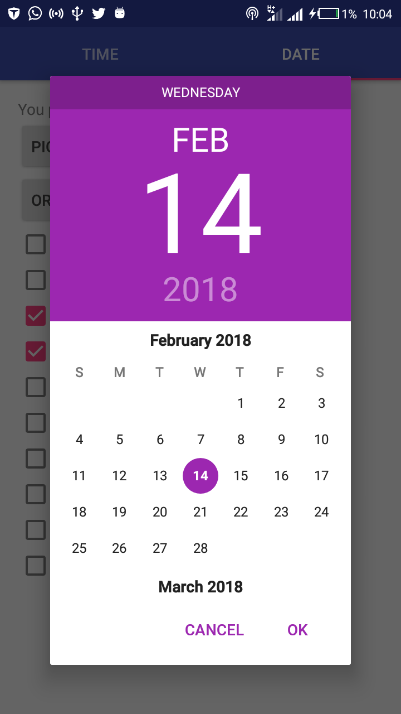
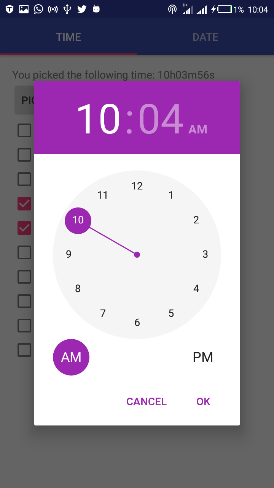

# Android DateTimePicker

:clock2:  :date: :calendar: Implementing material design date and time picker dialog  for android app

Image
-----

Setup Requirements
----------------

- 
Getting Started
----------------

In order to get the app running yourself, you need to:

1.  

Get in touch - Let's become friends
-----------------------------------

Please feel free to contact me if you have any questions, ideas or even if you just want to say hi. I’m up for talking, exchange ideas, collaborations or consults. You can connect with me through any of the avenues listed below:

- [Twitter](https://twitter.com/Ngesa254)
- [Github](https://github.com/ngesa254)
- [Medium](https://medium.com/@ngesa254)
- [Facebook](https://web.facebook.com/marvinngesa)
- [LinkedIn](https://www.linkedin.com/in/engngesamarvin) 

Found this project useful ❤️? Support by clicking the ⭐️ button on the upper right of this page. ✌️

References
----------

-

